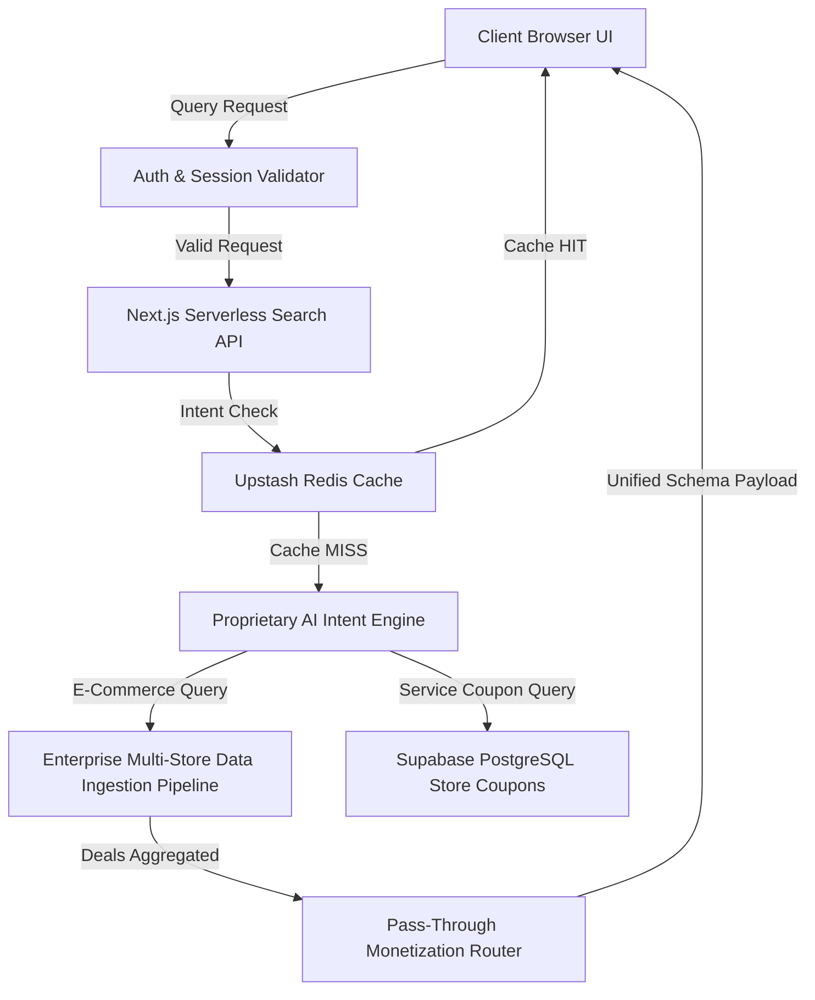

# ShopSmart AI - Client-Ready System Architecture Documentation

This document outlines the high-level system architecture, technology stack, data flow pipelines, security infrastructure, and regional data residency compliance for the ShopSmart AI platform.

---

## 1. Executive System Overview

ShopSmart AI is a high-performance, intelligent shopping platform that analyzes user shopping intents, scrapes inventory deals across merchant platforms, identifies active discount vouchers, and formats unified recommendations in real-time.

---

## 2. Frontend Technology Stack

* **Core Framework**: Next.js (App Router)
* **Styling & Theme**: Vanilla CSS with custom utility variables providing a dark cyberpunk-inspired glassmorphic theme.
* **Component Libraries**: Lucide Icons for high-fidelity vector icons.
* **Animations**: Framer Motion providing 3D perspective hover cards, pulse-animated interactive radar scanners, and dynamic confetti particle bursts.

---

## 3. Backend Technology Stack

* **Serverless Backend API**: Next.js Serverless Route Handlers executing low-latency API logic.
* **Caching & Queue Systems**: Upstash Redis Cache storing verified search results (exempt from quota limits) and managing a local request queue (`RequestQueue`) to coordinate high-concurrency requests safely.
* **Database & Auth**: Supabase PostgreSQL database storing store metadata, manual coupon details, telemetry analytics, and hosting the Supabase Auth session provider.

---

## 4. AI & Data Ingestion Pipeline

### Proprietary AI Intent Classifier
* Determines user request intent (e.g. `E-COMMERCE` vs `SERVICE_COUPON`) dynamically.
* If a query is classified as a coupon search, the scraper is bypassed, querying direct database store vouchers instantly to protect resource allocations.
* Features a local fallback rulebook classifier if the remote AI connector experiences network timeouts or rate limits.

### Enterprise Multi-Store Data Ingestion Pipeline
* Interrogates active product search indexes and maps raw payloads containing titles, price points, source merchant brands, ratings, and checkout links.
* Automatically executes simplified query fallback loops to guarantee search results are returned when specific search terms are too granular.

---

## 5. Regional Infrastructure & Data Residency

* **Core Deployment Platform**: Hosted on **Vercel US-East** serverless data centers.
* **Database Engine**: Hosted in the **Supabase US-East (N. Virginia)** region.
* **Redis Instance**: Deployed on **Upstash AWS US-East** infrastructure.
* **Compliance**: Fully compliant with **CCPA (California Consumer Privacy Act)** and **US Data Sovereignty Guidelines** by enforcing regional storage, localized API processing, and encrypted user metadata transport.

---

## 6. Enterprise Security Layers

* **Bot & Disposable Email Prevention**: Blocks signups using disposable temporary email addresses (e.g., tempmail, 10minutemail) to protect user allocations from automated bot abuse.
* **Client Throttle Guards**: Adds 300ms input debouncing and click submit throttling to prevent double-click API spamming.
* **Database Encryption**: Deployed on SSL/TLS transport routes, utilizing secure hashing algorithms for active sessions and preparation for AES-256 DB table encryption.
* **Data Sanitizer**: Implements rigorous URL unwrappers and clean-link filters to sanitize third-party tracking links before user redirect.
