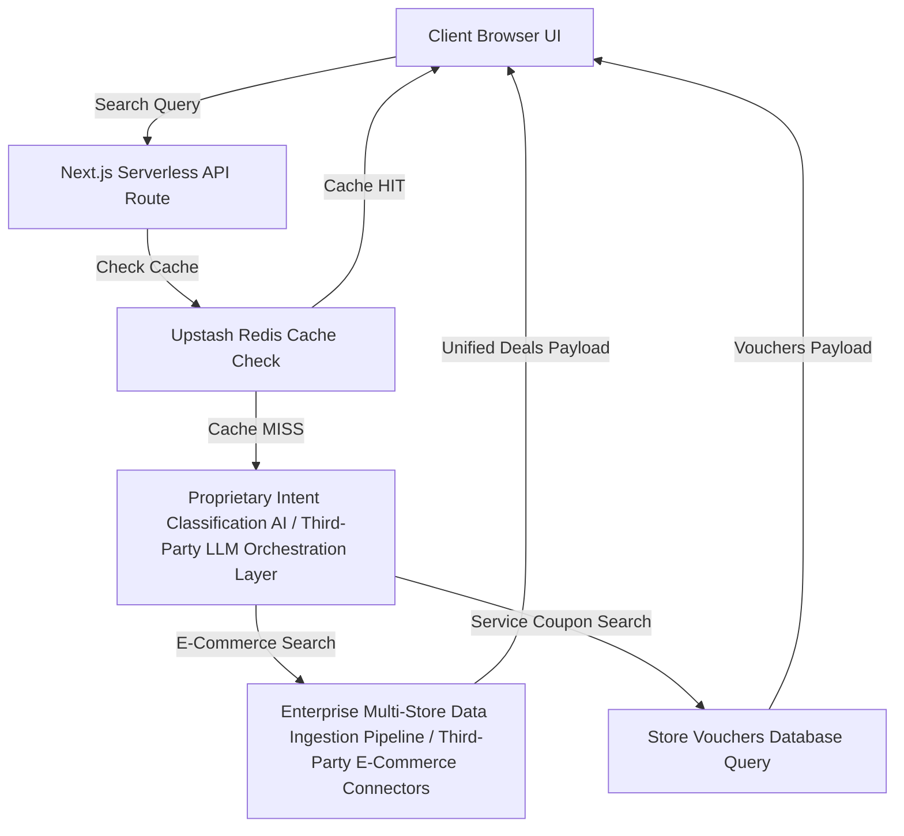

# ShopSmart AI - Core System Architecture Documentation

This document outlines the core system architecture, data flow, tech stack, and regional infrastructure layout for the ShopSmart AI platform.

---

## 1. Executive Summary

ShopSmart AI is a high-performance, intelligent shopping assistant and coupon discovery platform. The engine evaluates natural language user search queries, classifies search intents dynamically, and aggregates real-time merchant deals and verified store coupons to present unified shopping recommendations.

---

## 2. Core Data Flow Diagram

---

## 3. Technology Stack

| Component Layer | Technology Stack | Description |
| :--- | :--- | :--- |
| **Frontend** | Next.js (App Router), Tailwind CSS, Framer Motion, Lucide Icons | Responsive UI layer utilizing 3D perspective tilts, pulse radar scanners, and dynamic confetti overlays. |
| **Backend** | Next.js Serverless API Routes | Serverless endpoint routes managing search coordination and click telemetry logic. |
| **Cache & Queue** | Upstash Redis | Low-latency in-memory cache and concurrency execution queues. |
| **Database & Auth** | Supabase PostgreSQL | Manages persistent user sessions, active store details, manual coupons list, and telemetry metrics. |
| **AI & Connectors** | Proprietary AI Intent Engine & Enterprise Multi-Store Data Ingestion Connectors | Custom natural language classifiers and web inventory search parsers (maintaining vendor anonymity). |

---

## 4. Regional Infrastructure & Data Residency

* **Core Services**: Hosted on **Vercel US-East** Serverless infrastructure.
* **Persistent Database**: Hosted in the **Supabase US-East (N. Virginia)** AWS regional clusters.
* **In-Memory Cache**: Managed on **Upstash AWS US-East** infrastructure.
* **Compliance**: Enforces strict regional routing within the United States, guaranteeing full US Data Residency and CCPA data sovereignty compliance.
