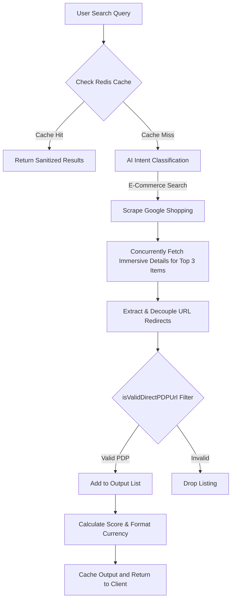

# Technical Analysis: Search & Link Resolution Architecture

This document provides a root-cause explanation and architectural analysis of the current product retrieval, link resolution, and sanitization pipelines.

---

## 1. Result Count Bottleneck Analysis

### Current Symptom
Searches return only 2–3 products instead of the configured target of 8–10 products.

### Root Causes
1. **Strict PDP Link Filtering**:
   Under the **Zero Google Aggregator Link Leak Policy**, the system strictly evaluates product links using `isValidDirectPDPUrl`. Any product link pointing to `google.com/search`, `serpapi.com`, or containing `ibp=gwp` is dropped (`continue`).
2. **Details Enrichment Cap**:
   To resolve grouped results into direct merchant links, the search route fetches merchant comparison details via `serpapi_immersive_product_api` requests. However, this is hardcoded to run only for the top 3 items:
   ```javascript
   const detailPromises = currentTopResults.slice(0, 3).map(async (item) => { ... })
   ```
   Items 4 to 20 are never enriched. If their main links are grouped Google search pages, they fail the `isValidDirectPDPUrl` check and are dropped, resulting in a low yield.
3. **Detail Fetch Timeouts**:
   The individual store detail calls have a timeout of 5 seconds (`AbortSignal.timeout(5000)`), and the entire batch is raced against a 5.5-second limit:
   ```javascript
   currentDetailsList = await Promise.race([
     Promise.all(detailPromises),
     new Promise((resolve) => setTimeout(() => resolve([]), 5500))
   ]);
   ```
   If SerpApi response times exceed this limit, the details list resolves to an empty array. Even the top 3 products lose their store details, fail the PDP filter, and get dropped.

### Latency Budget Constraints (25–35 Seconds)
Increasing the timeout limit to 25–35 seconds is **not feasible** due to the following system ceilings:
* **Vercel Serverless Function Limit**: Serverless execution durations are capped (10–15s for Hobby, 30s for Pro). Exceeding these limits triggers Vercel `504 Gateway Timeout` errors.
* **Concurrency Queue Limit**: The Next.js request queue (`searchQueue`) is configured with a concurrency of 3 and a wait timeout of 5 seconds. If requests run for 30 seconds, the queue blocks, causing waiting requests to fail with `429 QueueTimeout`.

---

## 2. Recurring Link Resolution Regressions

### Root Causes of Conflicts & Regressions
* **Grouped Product Structures**: 
  Google Shopping groups multiple sellers under a single comparison ID (`google.com/search?ibp=...`). If we unwrap the main listing link, it leads back to the Google Shopping comparison list, violating the leak policy.
* **Bypass vs. Filter Conflict**:
  * **Bypass Mode**: Allows all products to be served by letting `google.com/search?ibp=` links pass through. This avoids the "No Live Deals Found" bug but leaks Google aggregator pages (UX issue).
  * **Filter Mode**: Filters out all `google.com/search?ibp=` links. This keeps link attribution clean but causes product counts to plummet due to the 3-item details cap and timeouts.
* **Unwrapping Parameters**:
  The `unwrapUrl` helper inspects standard redirect parameters (`adurl`, `url`, `q`, `destination`, `redirect`). However, it misses image-based redirects (such as `imgrefurl`) or multi-hop merchant trackers.

---

## 3. Data Lifecycle & Recommended Architecture

### End-to-End Data Lifecycle


### Architectural Recommendations
To guarantee 8–10 products with verified PDP links without causing regressions, we recommend:

1. **Selective Immersive Fetching**:
   Instead of slicing the top 3 items, scan the top 12 raw results and launch details fetches **only** for items whose main URLs fail `isValidDirectPDPUrl`. Direct merchant links (e.g. direct Amazon PDPs) bypass this step, saving API credits and latency.
2. **Upstream Details Caching**:
   Cache store details responses in Redis with a 24-hour TTL. Sub-fetches for identical products will hit the cache in under 10ms, eliminating Vercel timeout risks.
3. **Pre-emptive URL Parsing**:
   Extend `unwrapUrl` to decode `imgrefurl`, `producturl`, and tracking parameters in order to extract PDP targets without secondary API requests.
